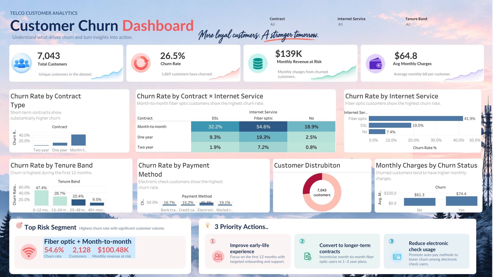

# 📡 Telco Customer Churn Analytics Dashboard


> An interactive Tableau dashboard designed to identify the customer groups most associated with churn, quantify the revenue exposure, and translate the results into practical retention actions.

## 🌐 Live Dashboard

🔗 **Tableau Public:**  
[Open the interactive dashboard](https://public.tableau.com/app/profile/mayil.huseynov/viz/TelcoCustomerChurnDashboardFinal/Overview)

## 🖼️ Dashboard Preview



---

## 🎯 Project Objective

Customer churn is one of the most important business problems in subscription-based industries.  
The purpose of this project is to move beyond a single overall churn rate and answer more actionable questions:

- Which customer groups are most likely to churn?
- How does churn differ by **contract type**, **internet service**, **tenure**, and **payment method**?
- Do churned customers have different monthly charges from retained customers?
- Which customer segment combines **high churn risk** with meaningful customer volume?
- How much monthly revenue is associated with customers who have already churned?
- What practical retention actions should the business prioritize?

The final result is a single-page executive dashboard built in **Tableau**, combining KPI monitoring, segmentation, interactive filtering, risk identification, and business recommendations.

---

## 📌 Executive Summary

The dashboard contains **7,043 customers**, of whom **1,869 churned**, producing an overall churn rate of **26.5%**.

The most important high-risk segment identified in the final dashboard is:

> **Fiber optic + Month-to-month**

This segment contains **2,128 customers**, has a **54.6% churn rate**, and represents approximately **$100.48K in monthly revenue at risk**.

Across the full customer base, the dashboard estimates approximately **$139K in monthly revenue associated with churned customers**.

---

## 📊 KPI Snapshot

| KPI | Value |
|---|---:|
| 👥 Total Customers | **7,043** |
| 🔄 Overall Churn Rate | **26.5%** |
| 👋 Churned Customers | **1,869** |
| 💰 Monthly Revenue at Risk | **$139K** |
| 💳 Avg Monthly Charges | **$64.8** |
| 🎯 Top Risk Segment | **Fiber optic + Month-to-month** |
| ⚠️ Top Risk Segment Churn Rate | **54.6%** |
| 👥 Customers in Top Risk Segment | **2,128** |
| 💸 Top Risk Segment Revenue at Risk | **$100.48K** |

> **Revenue at Risk** refers to the sum of monthly charges associated with customers who have churned. It should not be interpreted as lifetime or annual revenue loss.

---

## 🧭 Dashboard Structure

### 1. KPI Cards

The top row provides a quick executive view of:

- **Total Customers**
- **Churn Rate**
- **Monthly Revenue at Risk**
- **Average Monthly Charges**

The cards use consistent visual hierarchy, metric-specific icons, and subtle sparkline-style accents.

### 2. Churn Rate by Contract Type

This visual compares Month-to-month, One year, and Two year customers. Shorter-term contracts are associated with substantially higher churn.

### 3. Contract × Internet Service Heatmap

| Contract | DSL | Fiber optic | No internet |
|---|---:|---:|---:|
| Month-to-month | **32.2%** | **54.6%** | **18.9%** |
| One year | **9.3%** | **19.3%** | **2.5%** |
| Two year | **1.9%** | **7.2%** | **0.8%** |

The strongest risk concentration appears among **Fiber optic + Month-to-month** customers.

### 4. Churn Rate by Internet Service

- **Fiber optic:** 41.9%
- **DSL:** 19.0%
- **No internet:** 7.4%

Fiber optic customers show the highest observed churn rate among the internet-service groups.

### 5. Churn Rate by Tenure Band

| Tenure Band | Churn Rate |
|---|---:|
| 0–12 months | **47.4%** |
| 13–24 months | **28.7%** |
| 25–48 months | **20.4%** |
| 49+ months | **9.5%** |

The first 12 months show the highest churn rate.

### 6. Churn Rate by Payment Method

**Electronic check** customers show the highest observed churn rate at **45.3%**.

### 7. Customer Distribution

- **Total customers:** 7,043
- **Churned customers:** 1,869
- **Retained customers:** 5,174
- **Overall churn rate:** 26.5%

### 8. Monthly Charges by Churn Status

- **Retained:** $61.3
- **Churned:** $74.4

Churned customers pay higher monthly charges on average.

---

## 🎯 Top Risk Segment

### **Fiber optic + Month-to-month**

- 🔴 **Churn Rate:** 54.6%
- 👥 **Customers:** 2,128
- 💰 **Monthly Revenue at Risk:** $100.48K

This segment combines **high churn risk** with a **large customer population**, making it commercially important.

---

## 💡 Three Priority Actions

### ① Improve the Early-Life Customer Experience
- Improve onboarding and welcome journeys
- Trigger proactive support during the first months
- Monitor early service issues
- Test targeted retention offers before renewal decisions

### ② Encourage Longer-Term Contracts
- Test incentives for suitable month-to-month customers
- Focus especially on fiber optic customers
- Communicate longer-term plan benefits clearly
- Measure retention impact against margin

### ③ Investigate High-Risk Payment Behavior
- Promote automatic payment options
- Target electronic-check users with tailored communication
- Investigate links with other risk factors
- Review the billing and payment experience

---

## 🎛️ Interactivity

The dashboard includes interactive filters for:

- **Contract**
- **Internet Service**
- **Tenure Band**

These filters allow users to move from an overall view into specific customer segments and observe how KPIs and charts change.

---

## 🧹 Data Preparation & Analytical Decisions

### `TotalCharges`
The `TotalCharges` field required cleaning and conversion to numeric format.

### Churn Indicator
The original churn field uses categorical values:

```text
Yes = 1
No  = 0
```

### Tenure Bands
```text
0–12 months
13–24 months
25–48 months
49+ months
```

### Monthly Charges Quartiles
```text
Q1 = 35.50
Q2 = 70.35
Q3 = 89.85
```

---

## 🧮 Core Tableau Calculations

### Total Customers
```text
COUNTD(Customer ID)
```

### Churned Customers
```text
COUNTD(
    IF Churn = "Yes"
    THEN Customer ID
    END
)
```

### Churn Rate
```text
Churned Customers / Total Customers
```

### Average Monthly Charges
```text
AVG(Monthly Charges)
```

### Monthly Revenue at Risk
```text
SUM(
    IF Churn = "Yes"
    THEN Monthly Charges
    END
)
```

---

## 🎨 Dashboard Design

The dashboard was designed as an **executive analytics page** rather than a collection of unrelated charts.

Key design choices:

- 🌄 Soft telecom-themed background imagery
- 🔵 Navy typography
- 🔴 Coral/red emphasis for churn and high-risk metrics
- 🟢 Teal accents for revenue
- 🟣 Purple accent for monthly-charge metrics
- 🧩 Rounded white cards
- 📌 Direct labels
- 🎯 Dedicated risk and recommendation panels
- ✨ KPI icons and sparkline-style accents
- 🎛 Compact filters

Decision flow:

```text
Overall Situation
      ↓
Where is churn concentrated?
      ↓
Which segment is highest risk?
      ↓
What should the business do next?
```

---

## 🛠️ Tools & Technologies

-  **Tableau Public**
- 📊 Data Visualization
- 🧹 Data Cleaning & Transformation
- 🧮 Calculated Fields
- 🎛 Interactive Filters
- 🎯 Customer Segmentation
- 📈 Churn Analysis
- 💼 Business Insight Development

---

## 📁 Repository Structure

```text
Telco-Customer-Churn-Dashboard/
│
├── README.md
├── churn_dashboard.twbx
├── Overview.png
├── churn_dashboard_filtered.png
└── note.md
```

---

## 📦 Deliverables

- `churn_dashboard.twbx`
- `Overview.png`
- `churn_dashboard_filtered.png`
- `note.md`
- `README.md`

---

## ⚠️ Interpretation Notes

This dashboard is designed for **descriptive and diagnostic analysis**.

The observed relationships should not automatically be interpreted as causal. For example:

- Fiber optic customers have higher observed churn, but the dashboard alone does not establish that fiber optic service causes churn.
- Churned customers pay higher monthly charges on average, but price may interact with contract type, tenure, and other variables.
- Payment method may be useful for segmentation but can also reflect underlying customer characteristics.

The findings are best used to identify **where deeper analysis and targeted experiments should be prioritized**.

---

## 🚀 Possible Next Steps

- Churn probability modeling
- Customer lifetime value analysis
- Cohort-based churn tracking
- Retention-offer A/B testing
- Revenue forecasting
- Customer-level risk scoring
- Service-quality analysis
- Automated refresh through Tableau Cloud/Server

---

## 👤 Author

**Mayil Huseynov**

📊 Data Analytics • SQL • Python • Excel • Tableau • Power BI

🔗 [Tableau Public Dashboard](https://public.tableau.com/app/profile/mayil.huseynov/viz/churndashboard_17907753257660/Overview)

---

### ⭐ Project Takeaway

The main value of this project is not simply identifying that churn exists.

It shows **where churn is concentrated, which segment represents the greatest commercial exposure, and which retention actions should be investigated first**.
